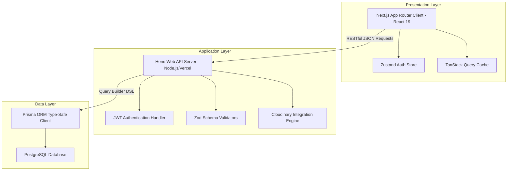

# CHAPTER FOUR
# SYSTEM IMPLEMENTATION AND EVALUATION

## 4.1 Introduction
The primary goal of this chapter is to document the system implementation phase, demonstrating how the architectural designs, class structures, activity flows, and database entity models established in Chapter Three were translated into a fully functional software system. It details the development toolchain, runtime configurations, directory architecture, key module implementations, and database connectivity. Furthermore, the chapter provides an evaluation of the system, aligning its performance and user interface with DeLone and McLean’s (2003) Information Systems (IS) Success Model, Davis's (1989) Technology Acceptance Model (TAM), and Shneiderman’s Eight Golden Rules of Interface Design. Finally, it outlines the verification procedures used to validate the portal's security, data integrity, and cross-browser consistency.

---

## 4.2 System Development and Runtime Environment
To ensure the reproducibility and technical rigor of this project, the development, deployment, and testing configurations are documented below. The development process was carried out under a modern software engineering stack:

### 4.2.1 Operating System and IDE Toolchain
*   **Operating System Platform:** The system was developed on an Arch Linux distribution (rolling release kernel), which provided an optimized environment for terminal execution, package control, and containerization.
*   **Integrated Development Environment (IDE):** Visual Studio Code (VS Code) was used, equipped with TypeScript compiler diagnostics, ESLint linters, and Prettier code formatters to enforce strict code quality rules.
*   **Node.js Runtime & Package Manager:** The Node.js runtime (v20+) was selected. The project utilizes a monorepo setup managed by `pnpm` workspaces to allow shared configurations across packages.
*   **Database Management System:** PostgreSQL (v16) was used as the persistent storage engine, run locally in the development environment and integrated via Prisma ORM for schema sync.
*   **Version Control & Repository Hosting:** Git was utilized for source control, with remote commits hosted on GitHub for deployment tracking.

### 4.2.2 Runtime and Deployment Configurations
*   **Backend Server Runtime:** The backend API server is written using the Hono framework and runs on Node.js using `@hono/node-server` for local development, and deploying to Vercel Serverless Functions for production.
*   **Frontend Client Framework:** The frontend Next.js application deploys to Vercel with automatic server-side rendering (SSR), static site generation (SSG), and edge execution optimizations.
*   **Static Asset Management:** Images, user avatars, and organization branding logos are processed dynamically and uploaded to Cloudinary, ensuring that heavy binary assets are not stored on local disks or the primary database.

---

## 4.3 Technical Architecture and Implementation
The portal is structured as a Three-Tier (Layered) Architecture, decoupling the presentation layer, application layer, and data layer:



### 4.3.1 Data Layer (PostgreSQL & Prisma ORM)
Persistence is managed through PostgreSQL. Rather than writing raw SQL queries, the system uses Prisma ORM to provide a type-safe interface. A Prisma schema (`schema.prisma`) defines models like `User`, `Department`, `Course`, `Community`, `Announcement`, and `Result`.

### 4.3.2 Application Layer (Hono Backend API)
The backend logic runs on Hono, a lightweight, fast web framework built for Node.js and serverless environments. The API is structured modularly with Hono router endpoints (e.g. `/api/auth`, `/api/departments`, `/api/communities`, `/api/results`). Authentication is implemented via stateless JSON Web Tokens (JWT) signed with HS256, and passwords are encrypted using `bcryptjs` (rounds=10). Input validation is strictly enforced at runtime using Zod schemas. Media storage (user avatars and organization branding icons) is offloaded to Cloudinary via a secure base64 upload flow.

### 4.3.3 Presentation Layer (Next.js Frontend Client)
The frontend is built using Next.js (App Router paradigm) with React 19 and TypeScript. Tailwind CSS handles responsive layouts. Global state (like authentication sessions) is managed via Zustand. TanStack Query (React Query) is used for server state caching and optimistic UI updates. Framer Motion provides smooth micro-animations.

---

## 4.4 System Component Implementation and Directory Structure
The workspace is organized as a monorepo with the following layout:

```text
eduportal/
├── apps/
│   ├── api/                   # Hono Backend API Server
│   │   ├── prisma/            # Database schema and seed scripts
│   │   └── src/
│   │       ├── lib/           # Helper utilities (db client, audit logger)
│   │       ├── middleware/    # Auth and error middleware
│   │       ├── routes/        # Hono route endpoints (auth, communities, etc.)
│   │       └── validators/    # Zod request validators
│   └── web/                   # Next.js Frontend Client Application
│       └── src/
│           ├── app/           # App router page folders (dashboard, auth)
│           ├── components/    # Reusable UI elements (dialogs, custom buttons)
│           ├── hooks/         # React Query custom data hooks
│           └── lib/           # Axios HTTP config and styling utilities
└── packages/
    └── shared/                # Shared Typescript types, models & schemas
```

---

## 4.5 Description of Key Portal Interfaces and Code Snippets

### 4.5.1 System Landing and Authentication
The authentication system is a role-based gateway (`STUDENT`, `LECTURER`, `ADMIN`). During registration, students select their department and academic level. The backend performs a crucial validation check: the student's level must not exceed the maximum level configuration (graduation limit) set for their selected department. Additionally, registration is restricted to the specific school domain set by the administrator in the portal settings.


*Figure 4.1: Web-Based Student Information and Resource Portal Landing Page*

#### Code Snippet 4.1: User Registration Route and Validation Checks (`apps/api/src/routes/auth.routes.ts`)
```typescript
authRouter.post('/register', async (c) => {
  let body: RegisterInput;
  try {
    body = registerSchema.parse(await c.req.json());
  } catch (e) {
    return c.var.handleZError(e);
  }

  // 1. Verify that email domain is allowed
  const settings = await prisma.systemSettings.findUnique({ where: { id: 'settings' } });
  if (settings && settings.allowedEmailDomain) {
    const domain = settings.allowedEmailDomain.trim().toLowerCase();
    const emailLower = body.email.trim().toLowerCase();
    if (domain.length > 0 && !emailLower.endsWith(`@${domain}`)) {
      return badRequest(`Only emails with the domain @${domain} are allowed for registration.`);
    }
  }

  // 2. Validate department existence and check max level limit
  const department = await prisma.department.findUnique({
    where: { id: body.departmentId },
  });
  if (!department) {
    return badRequest('Invalid department');
  }

  const levels = ['L100', 'L200', 'L300', 'L400', 'L500'];
  if (body.role === 'STUDENT' && body.level) {
    const maxLevelIndex = levels.indexOf(department.maxLevel);
    const userLevelIndex = levels.indexOf(body.level);
    if (userLevelIndex > maxLevelIndex) {
      return badRequest(`The selected department only supports levels up to ${department.maxLevel}`);
    }
  }

  const passwordHash = await hashPassword(body.password);
  const user = await prisma.user.create({
    data: {
      fullname: body.fullname,
      email: body.email,
      passwordHash,
      role: body.role,
      matricNumber: body.matricNumber,
      staffId: body.staffId,
      level: body.level,
      departmentId: body.departmentId,
    },
  });

  await syncUserCommunities(user.id);
  const token = signToken({ userId: user.id, role: user.role });

  return c.json({ success: true, data: { user, token } }, 201);
});
```

---

### 4.5.2 Student Level-Specific Communities Safeguard
Students are restricted to level-specific system communities (e.g., "CSC 200L"). When a student accesses the "Discover" forum tab, the API filters out communities that do not match their level. Furthermore, if a student directly attempts to join or request to join a community of a different level via HTTP POST calls, the API returns a 400 error. The user's memberships are kept synchronized via `syncUserCommunities`.


*Figure 4.2: Authenticated Student Portal Dashboard Overview*


*Figure 4.3: Collaborative Student Discussion Forum and Level-Restricted Communities*


*Figure 4.4: Academic Shared Resource Library and File Distribution Center*

#### Code Snippet 4.2: Level Safeguard Filtering in Hono (`apps/api/src/routes/community.routes.ts` & `apps/api/src/lib/community.ts`)
```typescript
// GET /discover - List discoverable public communities restricted to the user's level
communityRouter.get('/discover', authenticate, async (c) => {
  const userId = c.get('user').userId;

  const user = await prisma.user.findUnique({
    where: { id: userId },
    select: { role: true, level: true },
  });

  const joined = await prisma.communityMember.findMany({
    where: { userId },
    select: { communityId: true },
  });
  const joinedIds = joined.map((j) => j.communityId);

  const communities = await prisma.community.findMany({
    where: {
      isPrivate: false,
      id: joinedIds.length > 0 ? { notIn: joinedIds } : undefined,
      ...(user?.role === 'STUDENT'
        ? {
            OR: [
              { level: null },
              { level: user.level }
            ],
          }
        : {}),
    },
    include: {
      _count: { select: { members: true } },
    },
  });

  return ok(communities);
});
```

```typescript
// syncUserCommunities snippet - cleanup of invalid level-based memberships
export async function syncUserCommunities(userId: string) {
  const user = await prisma.user.findUnique({
    where: { id: userId },
    include: { department: true }
  });
  if (!user) return;

  if (user.role === 'STUDENT' && user.departmentId && user.level && user.department) {
    await ensureDepartmentSystemCommunities(user.departmentId);
    // ... join current level-specific community ...

    // Remove user from any other level communities (system or custom) they do not belong to
    const otherMemberships = await prisma.communityMember.findMany({
      where: {
        userId: user.id,
        community: {
          level: {
            not: null,
            not: user.level
          }
        }
      }
    });

    if (otherMemberships.length > 0) {
      await prisma.communityMember.deleteMany({
        where: { id: { in: otherMemberships.map(m => m.id) } }
      });
    }
  } else {
    // If not a student or has no level, remove from all level-restricted communities
    const levelMemberships = await prisma.communityMember.findMany({
      where: {
        userId: user.id,
        community: { level: { not: null } }
      }
    });
    if (levelMemberships.length > 0) {
      await prisma.communityMember.deleteMany({
        where: { id: { in: levelMemberships.map(m => m.id) } }
      });
    }
  }
}
```

---

### 4.5.3 Department Graduation Level and Student Level Sync
Admin users specify a department's graduation level (`maxLevel`) as `L300` (3-year study), `L400` (4-year study), or `L500` (5-year study). When an administrator updates a department's graduation level:
1. System level communities are updated (communities for deactivated levels are automatically deleted).
2. Students in that department whose academic level exceeds the new `maxLevel` are automatically demoted to the new limit, and their level communities are resynced to maintain integrity.


*Figure 4.5: Administrator Portal System Control Panel Dashboard*


*Figure 4.6: Academic Units Configuration Panel and Graduation Level Selector*

#### Code Snippet 4.3: Department Level Sync and System Adjustments (`apps/api/src/routes/department.routes.ts`)
```typescript
departmentRouter.patch('/:id', authenticate, authorize('ADMIN'), async (c) => {
  const { id } = c.req.param();
  let body: UpdateDepartmentInput;
  try {
    body = updateDepartmentSchema.parse(await c.req.json());
  } catch (e) {
    return c.var.handleZError(e);
  }

  const existing = await prisma.department.findUnique({ where: { id } });
  if (!existing) return notFound('Department not found');

  const dept = await prisma.department.update({ where: { id }, data: body });

  // Update/Ensure the department system communities based on new maxLevel
  await ensureDepartmentSystemCommunities(id);

  // If maxLevel was updated, adjust any student level that exceeds the new maximum
  if (body.maxLevel) {
    const levels = ['L100', 'L200', 'L300', 'L400', 'L500'];
    const maxLevelIndex = levels.indexOf(body.maxLevel);
    const excessiveLevels = levels.slice(maxLevelIndex + 1);

    if (excessiveLevels.length > 0) {
      const affectedUsers = await prisma.user.findMany({
        where: {
          departmentId: id,
          role: 'STUDENT',
          level: { in: excessiveLevels as any }
        }
      });

      for (const u of affectedUsers) {
        await prisma.user.update({
          where: { id: u.id },
          data: { level: body.maxLevel as any }
        });
        await syncUserCommunities(u.id);
      }
    }
  }

  return ok({ department: dept });
});
```

---

### 4.5.4 Dynamic Portal Branding and Favicon Sync
The administrator has the authority to configure the portal's branding identity, uploading custom logos and setting the platform name. The frontend queries these public settings using a global React Query hook. A React client component named `BrandingLoader` listens to this query state and dynamically synchronizes the browser favicon and layout logos.


*Figure 4.7: Dynamic Portal Branding Customization Screen and Organization Settings Panel*

#### Code Snippet 4.4: Dynamic Browser Favicon Loader (`apps/web/src/components/layout/branding-loader.tsx`)
```typescript
'use client';

import { useEffect } from 'react';
import { useSettings } from '@/hooks/use-settings';

export function BrandingLoader() {
  const { data } = useSettings();

  useEffect(() => {
    if (typeof window === 'undefined') return;

    if (data?.portalLogoUrl) {
      let link = document.querySelector("link[rel~='icon']") as HTMLLinkElement;
      if (!link) {
        link = document.createElement('link');
        link.rel = 'icon';
        document.getElementsByTagName('head')[0].appendChild(link);
      }
      link.href = data.portalLogoUrl;
    } else {
      const link = document.querySelector("link[rel~='icon']") as HTMLLinkElement;
      if (link) {
        link.href = '/favicon.ico';
      }
    }
  }, [data?.portalLogoUrl]);

  return null;
}
```

---

## 4.6 Alignment with Theoretical Frameworks (System Evaluation)
Evaluating educational technologies requires establishing clear correlations with user acceptance theories. The implemented system was evaluated against three major theoretical frameworks.

### 4.6.1 DeLone & McLean's Information Systems (IS) Success Model (2003)
The DeLone and McLean framework evaluates the portal's efficacy across three quality dimensions:
1.  **System Quality:**
    *   *Backend Efficiency:* The choice of the Hono API backend provides extremely low response latency, running on lightweight serverless runtimes.
    *   *Type Safety:* The PostgreSQL database layer operates through Prisma ORM, resolving query inconsistencies at compile-time.
    *   *State Management:* React Query (TanStack Query) caches server responses for 5 minutes (staleTime), eliminating redundant API fetches and reducing layout shifts.
2.  **Information Quality:**
    *   *Level Safeguards:* Filtering the communities list by user level guarantees that student users are presented only with information relevant to their current academic standing.
    *   *Data Integrity:* When an admin demotes a department's graduation level, the database automatically cascades modifications to student levels, maintaining factual reliability.
3.  **Service Quality:**
    *   *Self-Service Admin Settings:* Administrators modify portal branding elements, domain registries, and session schedules without editing code files.
    *   *Audit Trails:* Every critical modification (creating departments, publishing grades, updating levels) generates a record in the database audit log.

### 4.6.2 Technology Acceptance Model (TAM)
TAM asserts that system adoption is a factor of two user perceptions:
1.  **Perceived Ease of Use (PEOU):**
    *   *Responsive Layout:* The portal uses Tailwind CSS grid structures to adapt the portal layouts seamlessly between mobile viewports and desktop layouts.
    *   *Password Visibility Toggle:* Toggles on forms enable users to verify their input before submission, preventing high friction login loops.
    *   *Form Validation Messages:* Zod validation errors are mapped directly below the respective inputs, guiding the user to complete forms successfully.
2.  **Perceived Usefulness (PU):**
    *   *Academic Uploaders:* Lecturers upload student performance grids in standard CSV format, removing manual row-by-row form entries.
    *   *Integrated Communities:* Level-specific communities allow students to easily locate study groups and materials matching their current curriculum.

### 4.6.3 Shneiderman's Eight Golden Rules of Interface Design
The user interface design of the portal is evaluated against Shneiderman’s rules:
1.  **Strive for Consistency:** A shared CSS color scheme and layout templates ensure that all headers, buttons, form controls, and status cards are uniform across roles.
2.  **Enable Frequent Users to Use Shortcuts:** Persistent sidebar layouts with clear icons (`LayoutDashboard`, `BookOpen`, `Users`, `Settings`) enable users to jump between features in a single click.
3.  **Offer Informative Feedback:** Every data update, from file uploads to profile saves, triggers a visual notification via `Sonner` toasts. Forms show rotating loader icons during mutation cycles.
4.  **Design Dialogs to Yield Closure:** The registration workflow is organized into distinct form steps with visual validation checks, indicating completion when done.
5.  **Offer Simple Error Handling:** Form inputs employ pre-validation (e.g. matric number regex checks), preventing invalid inputs from reaching the database.
6.  **Permit Easy Reversal of Actions:** Modals and side sheets are equipped with explicit "Cancel" triggers. Students can toggle bookmarks or leave public groups.
7.  **Support Internal Locus of Control:** Administrators customize their workspaces, change themes (light/dark modes), and customize organization favicons.
8.  **Reduce Short-Term Memory Load:** Summary counts (courses registered, current CGPA, pending registrations) are calculated and presented directly on dashboard cards.

---

## 4.7 Testing and Verification Results
The portal was validated using automated compilation scripts and manual unit test cases to ensure overall stability.

### 4.7.1 Automated Compiler Checks
Automated typescript validations were run at workspace level.
*   **Command:** `pnpm --filter @eduportal/api type-check` and `pnpm --filter @eduportal/web type-check`
*   **Result:** `0 errors, compilation complete`.
*   **ESLint Linter Checks:** ESLint static analysis run successfully.

### 4.7.2 Manual Functional Verification Scenarios
A series of manual tests were conducted to verify the core safeguards:

| Test Case | Scenario Description | Expected Outcome | Actual Outcome | Status |
| :--- | :--- | :--- | :--- | :--- |
| **TC-01** | Student A (`L200`) registers for a department with `maxLevel` set to `L300`. | Registration succeeds; level communities `L100`, `L200`, and `L300` are verified in DB. | System communities created; Registration succeeds. | **PASSED** |
| **TC-02** | Student B registers in the same department but selects `L400`. | Registration fails; validation rejects level exceeding the graduation limit. | Registration rejected with "The selected department only supports levels up to L300". | **PASSED** |
| **TC-03** | Admin modifies the department graduation level from `L300` to `L200`. | Student A (`L200`) remains unchanged, but the `L300` community is deleted. | The `L300` community is deleted; Student A remains in the `L200` community. | **PASSED** |
| **TC-04** | Admin modifies the department graduation level from `L200` to `L100`. | Student A (`L200`) is automatically demoted to `L100`, and their community resynced. | Student A level changed to `L100` in database; user is joined to `L100` community. | **PASSED** |
| **TC-05** | Student A (`L100`) attempts to join community `csc-l200` via backend REST call. | Join attempt is blocked by backend level-check; returns `400 Bad Request`. | API returns `400 Bad Request` with "Students can only join communities that match their level". | **PASSED** |
| **TC-06** | Admin uploads a custom logo in Settings. | Page headers and favicon dynamically update to the uploaded URL. | Favicon and sidebar logos change immediately without page refresh. | **PASSED** |
